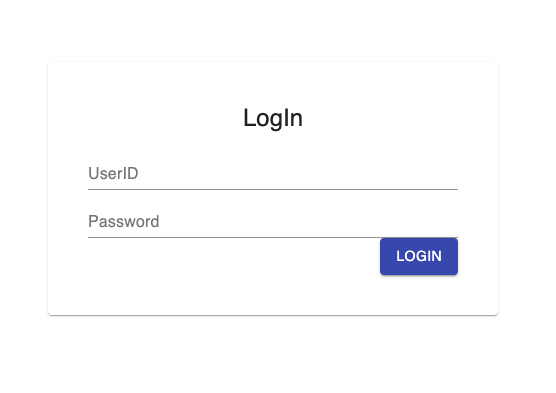
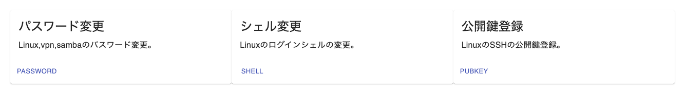

# ldap-portal
A simple and lightweight LDAP portal application.
You can change passwords, login shells, and add or delete public keys.





## How to deploy

For running development server, please refer to the next section.

### 1. Download (clone) the repository

```
ssh you@your-server.example.com
git clone git@github.com:nkzwlab/ldap-portal.git
cd ldap-portal
```

### 2. Setup environment

Copy the sample.env and edit it.

```
LDAP_URI=ldaps://ldap.example.com/
LDAP_DOMAIN=dc=example,dc=com
ADMIN_CN=admin
PASSWORD=admincn_password
ADMIN_GROUP=administrators
EMAIL_DOMAIN=example.com
UID_NUMBER_START=10001
DEFALUT_GID_NUMBER=10001

NODE_ENV=development|test|production
SECRET=SECRETKEY
DEPLOY_DOMAIN=ldap-portal.example.com

REDIS_URL=redis://redis
REDIS_PASSWORD=redis_password

SLACK_SIGNING_SECRET=<your-signing-secret>
SLACK_BOT_TOKEN=xoxb-<your-bot-token>
SLACK_WEBHOOK_URL=https://hooks.slack.com/...
```

### 3. Start the server

First, start the containers with default configuration.

The default docker-compose.yml is configured to run as "staging" environment.  
The purpose is to verify your DNS configuration for https-portal, so change the environment to "production" by editing docker-compose.yml.

```
docker compose --profile prod up --build --detach
docker compose --profile logs logs --follow
```

Once you could see the web page in `https://your-domain.example.com/` (with TLS errors), edit `docker-compose.yml` and restart the server.

```
vim docker-compose.yml
docker compose --profile prod down
docker compose --profile prod up --build --detach
```

Then open `https://your-domain.example.com/` again.  
If insecure TLS error disappears, it works!

## How to Develop

### 1. Create .env and .ldap.env file

You can copy sample files

```
cp sample.env .env
cp sample.ldap.env .ldap.env
```

```.env
LDAP_URI=ldap://ldap.example.com/
LDAP_DOMAIN=dc=example,dc=com
SECRET=SECRETKEY
PASSWORD=admincn_password
DEPLOY_DOMAIN=ldap-portal.example.com
ADMIN_CN=admin
EMAIL_DOMAIN=example.com
NODE_ENV=development|test|production
```

```.ldap.env
LDAP_ADMIN_PASSWORD=YourPassw0rd!
LAM_PASSWORD=YourPassw0rd!
```

### 2. Run containers

```
docker compose --profile dev --profile ldap up --build
```

### 3. Configure local LDAP server

1. Open `http://localhost:8081/`
2. Log in with the password you configured through env var `LDAP_ADMIN_PASSWORD`
3. Create first schema by following the prompt

### 4. Start developing

Edit each .tsx files then the page hot-reloads immediately.
