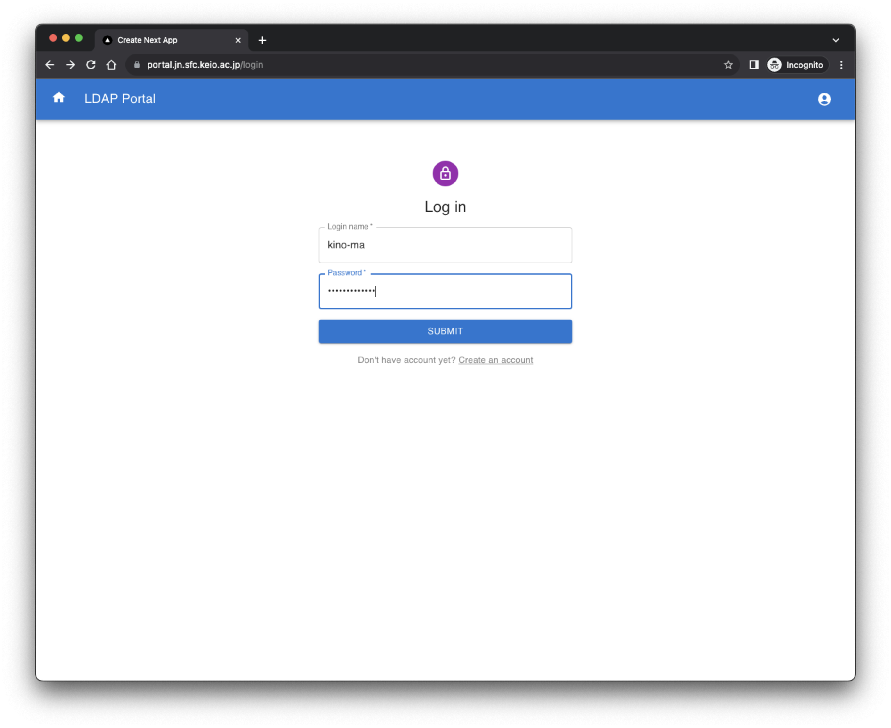
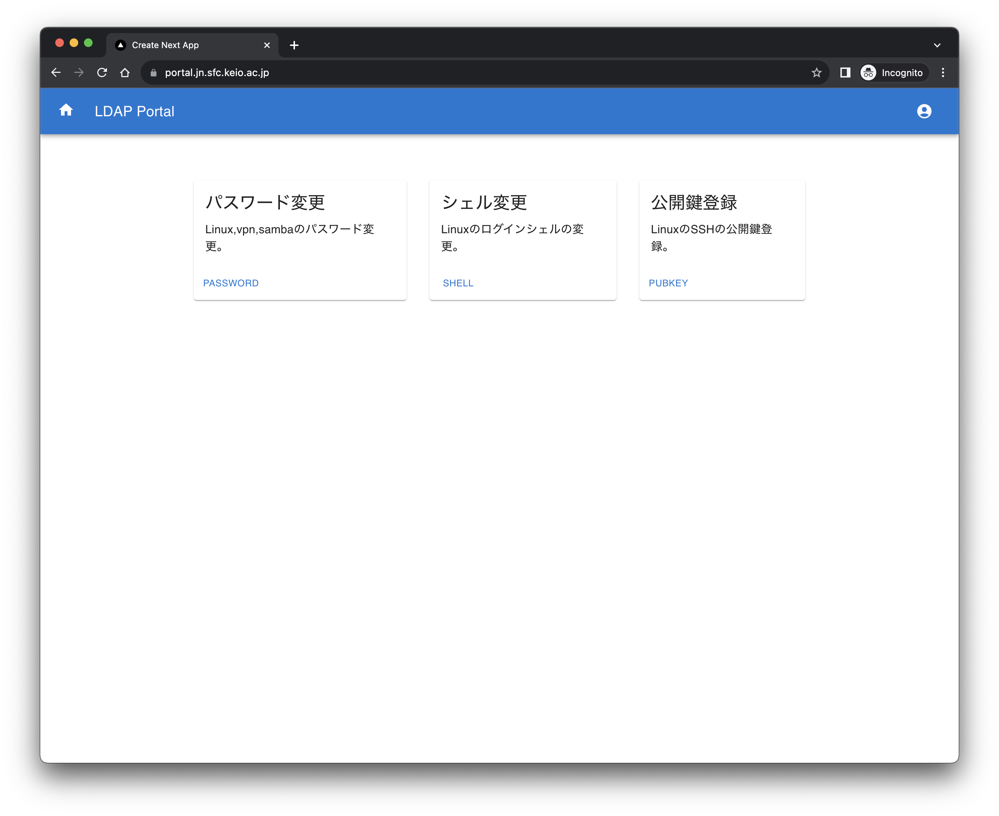
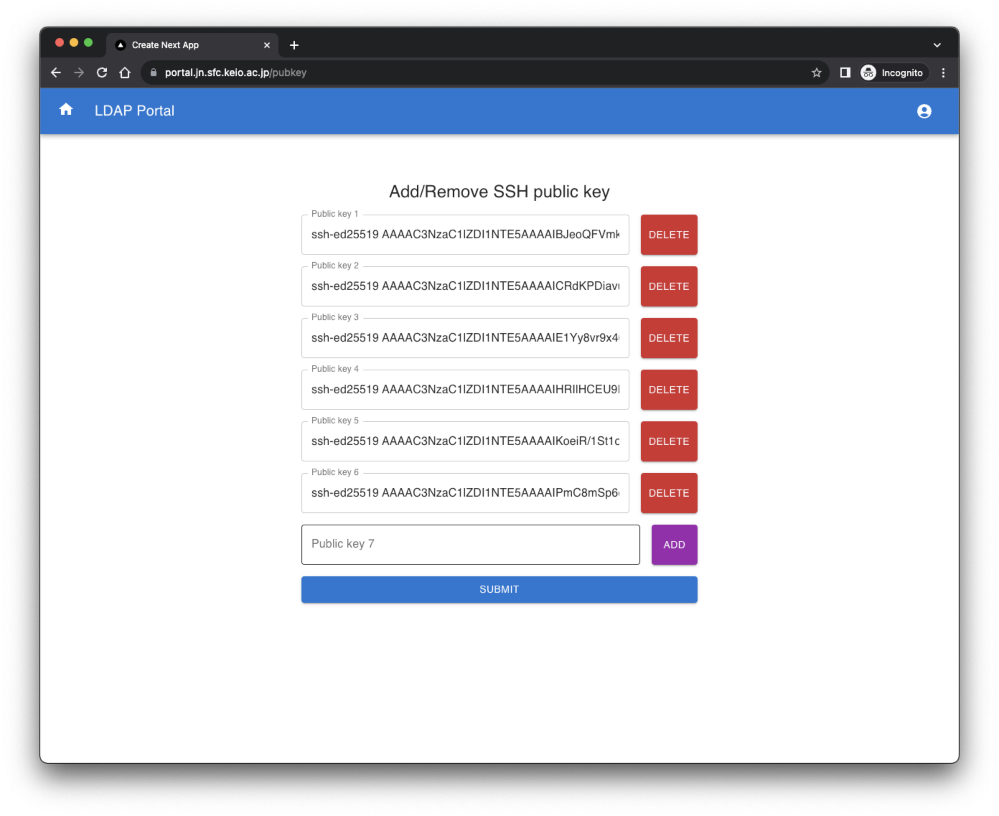

# ldap-portal
A simple and lightweight LDAP portal application.
You can change passwords, login shells, and add or delete public keys.






## How to deploy

### 1. create .env and .ldap.env file

You can copy sample files

```
cp sample.env .env
cp sample.ldap.env .ldap.env
```

```.env
LDAP_URI=ldap://ldap.example.com/
LDAP_DOMAIN=dc=example,dc=com
SECRET=SECRETKEY
PASSWORD=admincn_password
DEPLOY_DOMAIN=ldap-portal.example.com
ADMIN_CN=admin
EMAIL_DOMAIN=example.com
NODE_ENV=development|test|production
```

```.ldap.env
LDAP_ADMIN_PASSWORD=YourPassw0rd!
LAM_PASSWORD=YourPassw0rd!
```

### 2. docker run

```
docker-compose up -d
```

## LDAP Schema
Here is the LDAP schema that this application is based on.
[schema](docs/schema)

## How to develop

1. docker compose up
2. localhost:8081 でログイン
    - `Hogefuga123!`
3. 「作成」ボタンを押す